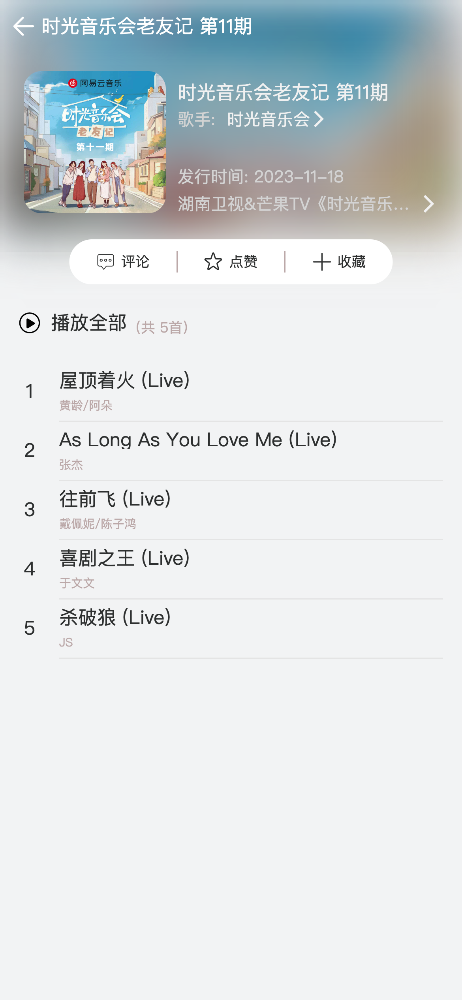
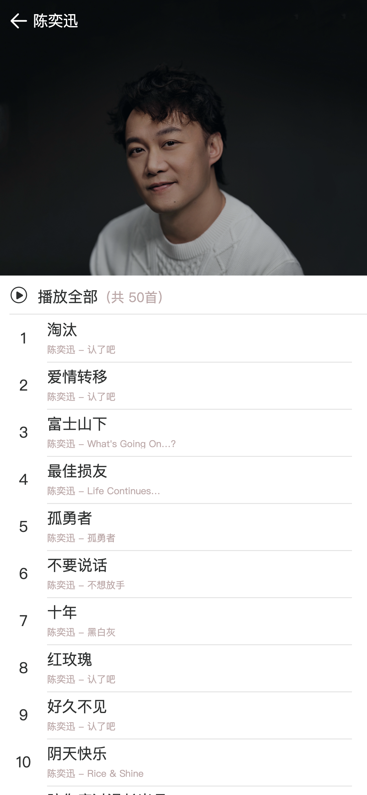
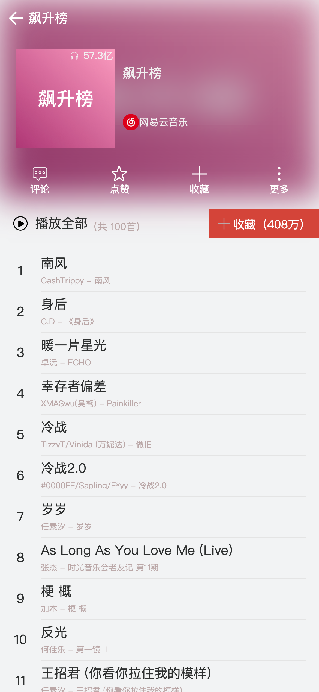

# 概述
{:height="50%" width="50%"}

网页云音乐H5项目, 技术栈:
- React: 18
- 状态管理: react-redux @reduxjs/toolkit
- 路由管理: react-router-dom
- css in js: styled-component

# Road Map
- [学习styled-component🚶](note-docs/styled-component.md)
- [学习移动端布局🚶](note-docs/mobile-css-layout.md)
- [学习react-router-dom🚶](note-docs/react-router.md)
- [学习Redux🚶🚶](note-docs/mini-redux/)
- [学习RTK🚶🚶🚶](https://redux-toolkit.js.org/usage/usage-guide)
- 学习React性能优化 
  - 图片加载优化 
  - React组件优化
- 学习服务部署
  - （考虑下Vite？）

# 待开发功能

- 支持主题切换